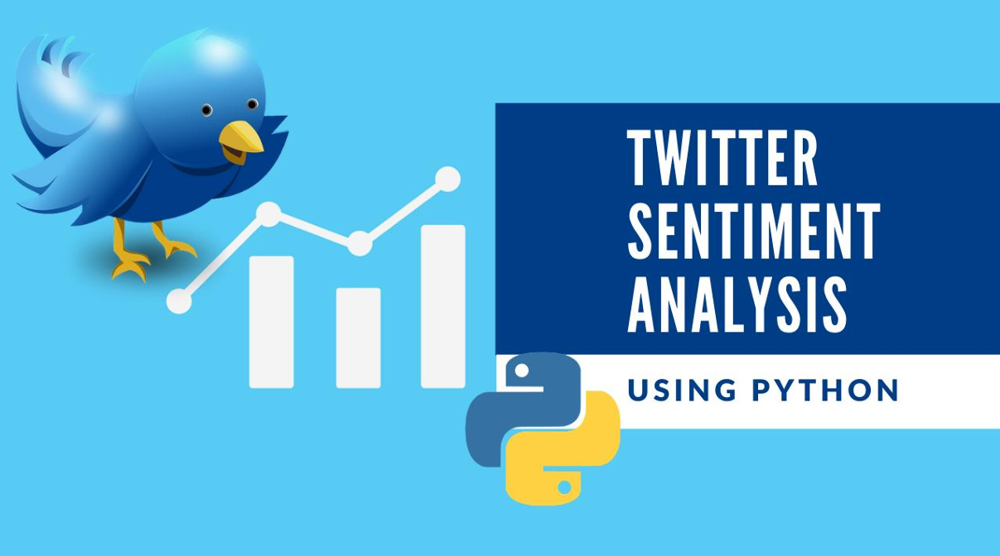

# Analyse de Sentiments Twitter 🐦



## 📝 Description

Ce projet implémente une analyse de sentiments sur des tweets en utilisant Python. Il permet d'évaluer si un tweet exprime un sentiment positif ou négatif en se basant sur des listes de mots prédéfinies.

## 👥 Auteurs

- Mohamed Islem Ben Farhat
- Oussama Benali

## 🛠️ Technologies Utilisées

- Python
- Pandas (manipulation des données)
- Matplotlib (visualisation)
- Bibliothèques standards Python (string)

## 📊 Fonctionnalités

1. Lecture et traitement des tweets depuis un fichier CSV
2. Analyse des sentiments basée sur des dictionnaires de mots positifs et négatifs
3. Calcul des scores de sentiment:
   - Score positif
   - Score négatif
   - Score net (différence entre positif et négatif)
4. Visualisation de la corrélation entre les sentiments et les retweets
5. Export des résultats dans un fichier CSV

## 📁 Structure du Projet

```
├── logo.png                    # Logo du projet
├── negative_words.txt          # Liste des mots négatifs
├── positive_words.txt          # Liste des mots positifs
├── project_twitter_data.csv    # Données des tweets à analyser
├── project_twitter.ipynb       # Notebook principal
└── result_data.csv            # Résultats de l'analyse
```

## 🚀 Comment Utiliser

1. Assurez-vous d'avoir Python et les bibliothèques requises installées:
   ```bash
   pip install pandas matplotlib
   ```
2. Placez vos fichiers de données (tweets et listes de mots) dans le même répertoire
3. Exécutez le notebook Jupyter `project_twitter.ipynb`

## 📈 Résultats

Le programme génère:

- Un fichier `result_data.csv` contenant les scores de sentiment pour chaque tweet
- Des visualisations montrant la relation entre les sentiments et l'engagement (retweets, réponses)

## 🔍 Méthodologie

1. Prétraitement des tweets (suppression de la ponctuation)
2. Identification des mots positifs et négatifs
3. Calcul des scores de sentiment
4. Analyse de la corrélation avec les métriques d'engagement
5. Visualisation des résultats
